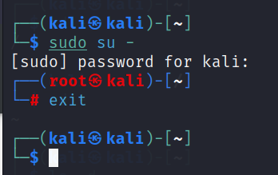
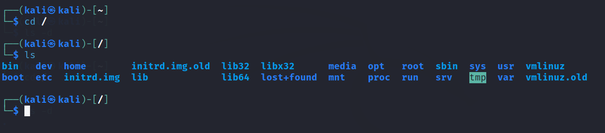
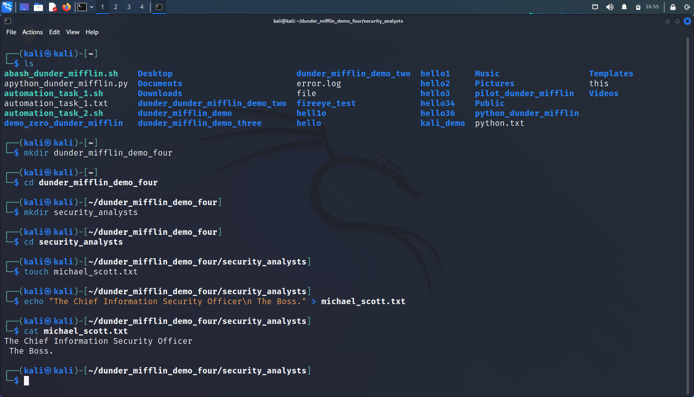

# basic_cli_commands_for_hackers

The shell/console/terminal is nothing more than a program which accepts your commands and executes those commands.
Also known as a command line interpreter.
The command line is more powerful and will always be here… you will use the command line to
configure routers, firewalls, etc
User permissions:

| command: | behaviour: | 
| :-------------: | :-------------: |
|`$`| Denotes Regular User|
|`#`| Denotes Superuser |

Example:

| command: | behaviour: | 
| :-------------: | :-------------: |
|`/`| Known as the root directory|
|`/bin`| Binaries and other executibles programs reside here|
|`/etc`| System configuration files|
|`/home`| Home directories|
|`/opt`| Optional or third-party software |
|`/tmp`| Temporary space, typically cleared on reboot |
|`/usr`| User related programs |
|`/var`| Variable data, most notably log files |

| command: | behaviour: | 
| :-------------: | :-------------: |
|`ls`| List directory contents|
|`cd[dir]`| Changes current directory to dir|
|`pwd`| Displays the present working directory name. If you don't know what directory you are in, do pwd.|
|`cat [file]`| View contents of a file|
|`echo [argument]`| Displays argument to screen |
|`man`| Displays the online manual for a command |
|`exit, logout, or CTRL-D`| Exits the shell or current session |
|`clear`| Clear screen |
|`touch`| Creates or updates a file |

When using the man pages, you can navigate around the page using the following commands below:

| command: | behaviour: | 
| :-------------: | :-------------: |
|`Enter`| Move down a line|
|`Space`| Move down one page|
|`g`| Move to the top of the page.|
|`G`| Move to the bottom of the page|
|`q`| Quit|

WORKING WITH DIRECTORIES
Directories are simply containers for files and other directories. They provide a tree like structure for organizing
the system.

Here are the most common directory commands:

| command: | behaviour: | 
| :-------------: | :-------------: |
|`.`| List directory contents|
|`..`| Changes current directory to dir|
|`/`| Displays the present working directory name. If you don't know what directory you are in, do pwd.|
|`cd - or cd`| View contents of a file|
|`mkdir [-p]`| Displays argument to screen |
|`rmdir [-p]`| Displays the online manual for a command |
|`exit, logout, or CTRL-D`| Exits the shell or current session |
|`clear`| Clear screen |
|`touch`| Creates or updates a file |

LISTING DIRECTORIES
ls shows the output of files contents
Here are some options you can use for ls:

| command: | behaviour: | 
| :-------------: | :-------------: |
|`-a`| All files, including hidden files|
|`--color`| List files with colorized output|
|`-d`| List directory names and not their contents|
|`-l`| Long format |
|`-r`| Reverse order |
|`-R`| List files recursively |
|`-t`| Sort by time, most recent modified first |
|`-latr`| Long listing with time (most recent files displaying on screen) |

To use these options, simply type in ls followed by the option (also known as a flag)
`-ls -l`
When typing in the ls -l option, the output will be a long listing format of the contents of each file. Here is an
example of the long listing format and what each section means:

FILE AND DIRECTORY PERMISSIONS
-rw-r--r--

| character: | file type: | 
| :-------------: | :-------------: |
|`-`| Regular file|
|`d`| Directory|
|`l`| Symbolic Link|

| character: | permission: | 
| :-------------: | :-------------: |
|`r`| read|
|`w`| write|
|`x`| execute|

Permissions on files act as read, write, and execute.
Permissions on directories:
• Read: Allow file names to be read
• Write: Allows entries to be modified within the directory
• Execute: Allows access to contents and metadata for entries in the directory

Permissions Categories for Users:

| character: | file type: | 
| :-------------: | :-------------: |
|`u`| User (user who owns the file)|
|`g`| Group (users that are in the file's group|
|`o`| Other (users who do not own or are not in files group)|
|`a`| All - user who do not own or are not in files groups|

Every user is a member of at least one group, called the primary group.
To find what group you are apart of use: groups or `id -Gn`
Hyphen `(-)` denotes user does not have the privilege

CHANGING FILE PERMISSIONS
The chmod command is used to change permissions on the categories (user, group, and other)

| character: | file type: | 
| :-------------: | :-------------: |
|`ugoa`| u for user, g for group, o for other, a for all|
|`+-=`| + to add permission, - to subtract, = set all|
|`rwx`| r for read, w for write, x for execute|

Example of adding write permissions to group category: chmod g+w file
Example of adding write permissions to user & group category: chmod ug+w file
Example of adding read permissions to all categories: chmod a=r file

## Changing File Permission (Octal Mode)
Represented in binary. 0 means off, 1 means on → must convert to base 10

## Commonly used permissions (octal mode)

700 Files can be read, written, and executed by owner
755 Allows everyone on the system to execute, but only owner can modify
664 Allows a group of people to modify the file and let others read it
660 Allows a group of people to modify the file and not let others read it
644 Allows everyone on the system to read the file but only the owner can edit it
777 & 666 should be avoided

| Octal: | status: | 
| :-------------: | :-------------: |
|`700`| Files can be read, written, and executed by owner|
|`755`| Allows everyone on the system to execute, but only owner can modify|
|`644`| Allows a group of people to modify the file and let others read it|
|`660`| Allows a group of people to modify the file and not let others read it|
|`644`| Allows everyone on the system to read the file but only the owner can edit it|
|`777 & 666`| should be avoided|

By default you are placed into your primary group. If you want to change your group, use:
chgrp group_name file

FINDING FILES AND DIRECTORIES
Use the find keyword to locate a file or directory.
find [path…] [expression]

| command: | behaviour: | 
| :-------------: | :-------------: |
|`find . -name pattern`| Displays file names which matches pattern (case sensitive)|
|`find . -iname pattern`| same as -name, but ignores case|
|`find . -ls`| Performs an ls on each of the found files or directories|
|`find . -mtime num_days`| Finds files that are num of days old|
|`find . -size num`| Find files that are size of num|
|`find . -newer file`| Finds files that are newer than file|

In addition to find, you can also use the locate pattern keyword. Locate is indexed by updateb each day, so it may
not reap the most accurate results

### VIEWING AND EDITING FILES
Commands to display the contents of files to the screen:

| command: | behaviour: | 
| :-------------: | :-------------: |
|`cat file `| Display entire file contents|
|`more file`| Browse through file, use spacebar to advance|
|`less file`| Similar to more but backward movement|
|`head file`| Output the beginning of the file|
|`tail file`| Output the ending of the file|

cat does not update in real-time; tail & head are real-time updates to view a file
To view a file in real-time:
tail -f file
There are multiple editors you can choose when it comes to creating and editing files. The well-known editors in
Linux are Nano, Vim, and Emacs…

Nano
• Very simple editor (not as complex as vi or emacs)
• To view a file in nano: nano file.txt
• To save your edits: CTRL-o
• To quit: CTRL-x

Vim
To edit a file in vi: vi [file] or vim [file] or view [file]
Vi has an updated version, Vim which standards for “VI Improved”

There are three modes in Vim:
• Command Mode: allows you to navigate the file, perform searches, delete, copy, paste text, etc
o Enter command mode [esc]
• Insert Mode: insert, edit text
o Enter Insert mode [i, I, a, A]
• Line Mode: perform specific types of saves, quit, etc
o Enter Line mode [:]
Vi Command Cheat Sheet: [Link]

Editing Files with Emacs
Emacs is similar to VIM
To edit a file in emacs: emacs [file]
C-<char> → CTRL while pressing <char>
M-<char> → Meta Key or ALT key
Emacs Command Cheat Sheet: [Link]

DELETING, COPYING, MOVING, AND RENAMING FILES
Removing files:

| command: | behaviour: | 
| :-------------: | :-------------: |
|`rm file`| Remove file|
|`rm -r dir`| Remove the directory and its contents|
|`rm -f file`| Force removal and never prompt for confirmation|

## Copying Files:

| command: | behaviour: | 
| :-------------: | :-------------: |
|`cp source_file destination_file`| Copy source_file to destination_file|
|`cp src_file1 [...] dest_dir`| Copy source_files to destination_directory|
|`cp -r dir dest_dir`| Copy dir to dest_dir recursively.|

  
## Moving Files:

| command: | behaviour: | 
| :-------------: | :-------------: |
|`mv`| Move or rename files and directories|
|`mv source destiantion`| Move file from source to destination|
|`mv -i source destination`| Move interactive mode|
|`mv filename1.txt filename2.txt`| Renaming Files|

  
ARCHIVING AND COMPRESSING FILES
Creating a Collection of Files to Archive and easily transfer:
`tar -czvf name-of-archive.tar.gz /path/to/directory-or-file`

| command: | behaviour: | 
| ------------- | ------------- |
|`tar`| Create, extraxt, or list contents of a tar archive using patter if supplied|            --check image for tarball --install tarball
|`tar -cf`| Create and name archive|
|`tar -v`| Enable verbose mode, see the contents being archived|
|`tar -z`| Enable gzip to tar|
  
  
  

Compressing Files to Save Space:

| command: | behaviour: | 
| :-------------: | :-------------: |
|`gzip`| Compress file|                                             --check image for gzip --install gzip
|`gunzip`| decompress file|
|`gzcat`| Concatenates compressed files|
|`zcat`| Concatenates compressed files|
  

  
INPUT AND OUTPUT REDIRECTION
Input, Output, and Redirection
• Three I/O Types
• Standard Input / stdin / 0
• Standard Output / stdout / 1
• Standard Error / stderr / 2
Redirection:
  
  | character: | behaviour: | 
| :-------------: | :-------------: |
|`>`| Redirects standard output to a file|                                             --check exa,mples of redirections (input)
|`>>`| Redirects standard output to a file. Appends to any existing content|
|`<`| Redirects input from a file to a command|
|`&`| Used with redirection to signal that a file descriptor is being used|
|`2>&1`| Combine stderr and standard output|
|`2>file`| Redirect standard error to a file|
|`>/dev/null `|Redirect output to a trash can|
  

  
  
Why do we need to learn input and output redirection?

- Input / Output Redirection allows you to combine multiple commands together in one line, making it
more efficient to use
  

  
SEARCHING FOR PATTERNS IN FILES
Use Grep to find text within a file:
  
  | character: | behaviour: | 
| :-------------: | :-------------: |
|`grep pattern file_n`| Search for a pattern in a file.|                                             --check exa,mples of redirections (input)
|`grep -v pattern file_n`| Invert Match. Return files that do not match|
|`grep -i`| Perform a search ignoring case|
|`grep -c`| Count the number of occurences in a file|
|`grep -n`| Combine stderr and standard output|
  

  
PIPES
The Pipe `(|)` means take the standard output from the preceding command and pass it as the standard input to the
following command. If the first command displays error messages those will not be passed to the second
command.

• You can also chain pipe commands
command-output | command-input
Example: `strings BlueTrain.mp3 | grep -i john | head -1`
Common use of grep and piping: cat file | grep pattern or grep pattern file

  
  
PROCESS CONTROL
Process Commands
  
  | command: | behaviour: | 
| :-------------: | :-------------: |
|`ps`| Display process status|
|`ps -e`| Displays everything|
|`ps -f`| Full format listing|
|`ps -u username`| Display processes running as username|
|`ps -p pid`| Display process information pid. PID is the process ID|
|`ps -ef`| Display all processes|
|`ps -eH`| Display a process tree|
|`ps -e --forest`| Display a process tree|
|`ps -u username`| Display processes running as username|
|`top`| Interactive process viewer|
  

  
CREATING AND SWITCHING USERS
One way to start a session as another user on a system is to use the su command.
`su [username]` → change user ID or become superuser
Common su Commands:
`su -` → Used to provide an environment similar to what the user would expect had the user logged in directly
`-c` command → Specify a command to be executed.
`whoami` → Displays the effective username
You can also use `sudo` to execute a command as another user, but you do not need to know the password of the
other user.
  
  
 
  
Sudo Commands

  
| command  | behaviour  |  
|---|---|
| `sudo -l`  | List available commands  |  
| `sudo command` | Run commands as superuser |   
| `sudo -u root command` | sudo command  |   
| `sudo -u user command`  | Run command as user  |
| `sudo su`  | Switch to the superuser account  |
| `sudo su -` | Switch to the superuser account |
| `sudo su - username`  | Switch to the username account  |
  

  

INSTALLING SOFTWARE
When you install software on a Linux system, you do so with a package. A package is a collection of files that make
up an application.
  
• Package managers manage dependencies
Installing Software on CentOS, Fedora, and RedHat -- show google slides
  
Use yum command show examples on chatGPT
  

  
| command  | behaviour  |  
|---|---|
| `yum search search-string`  | Search for search string  |  
| `yum install [-y] package` | Install package |   
| `yum remove package` | Remove/uninstall package  |   
| `yum info [package]` | Display information about package|
   
    
You can use the `rpm` command to interact with the package manager   --chatGPT
  
Installing Software on Debian and Ubuntu
Ubuntu and Debian use Advanced Packaging Tool:
  
   | command: | behaviour: | 
| ------------- | ------------- |  
|`apt-cache search search-string`| Search for search-string|
|`apt-get install [y] package `| Install package|
|`Apt-get remove package`| Remove/uninstall package|
|`apt-get purge package`|Remove/uninstall package|
|`apt-cache show package `|Display information about package|

You can use the dpkg command to interact with the package manager

